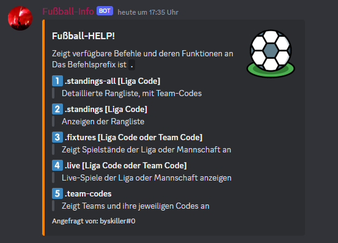
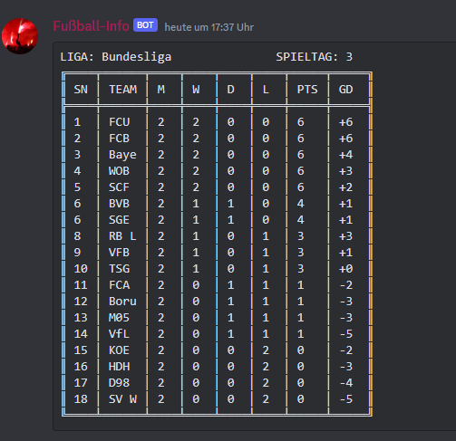
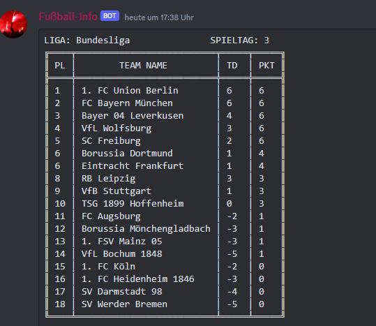
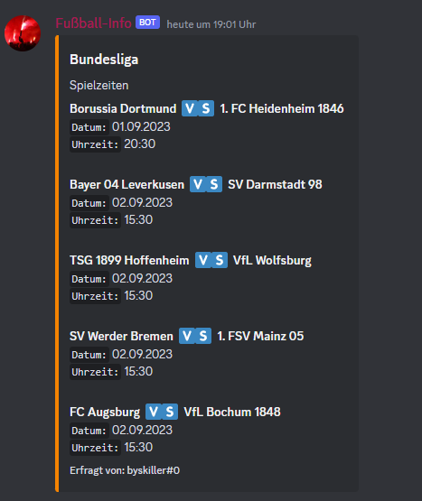
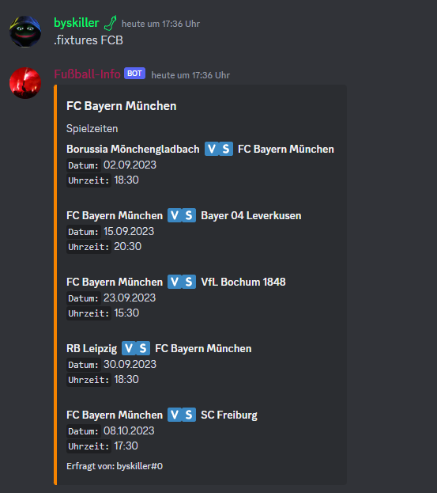

<h1 align="center">FußballBot überarbeitet von Paneka</h1>
<p align = "center"><br><br>

<h2 align="center">Support <a href = "https://discord.gg/3mbTDaK3">Server</a></h2>
<h2 align="center">Klicke <a href = "https://discord.com/api/oauth2/authorize?client_id=1075470338340704398&permissions=8&scope=bot">hier</a> um den Bot auf deinen Server einzuladen!</h2>
</p>
<hr>

# Einleitung
FußballBot für Discord geschrieben mit Tabelle, Spielständen, Live Ergebnisse, Spielzeiten in `python` mit [discord.py](https://pypi.org/project/discord.py/) und derzeit gehostet auf meinem Eigenen Server.

Die API, die für den Abruf von Fußballdaten verwendet wird [football-data.org](https://football-data.org) Kostenloser Tarif und daher haben wir eine Rate Limit von **10 Requests / Min** und **12** Wettbewerbe.

# Commands
### 1. Help
Zeigt die zur Verfügung stehenden Befehle an

**Nutzung:** `.help`

<p align="center">

</p>

### 2. Standings All
Erzeugt eine detailliertere Tabelle mit Toren, Gegentoren, gewonnenen und verlorenen Spielen

**Nutzung:** `.standings-all [league code]`

<p align="center">

</p>

### 3. Standings
Erstellt den aktuellen Tabellenstand in der gewünschten Liga.

**Nutzung:** `.standings [league code]`

<p align="center">

</p>

### 4. Fixtures
Zeigt die nächsten Spiele an, die für die gewünschte Mannschaft oder Liga geplant sind.
Für die 1.Bundesliga z.B **FCB, BVB, BMG**

**Nutzung:** `.fixtures [league code | team code] [limit: standart 5]`

Limit schränkt die Anzahl der angezeigten Geräte ein und beträgt standardmäßig 5

#### 4.1 League Fixtures

<p align="center">

</p>

#### 4.2 Team Fixtures

<p align="center">

</p>

### 5. Live Scores
Zeigt die Live-Ergebnisse von Spielen in der gewünschten Liga oder Mannschaft an

**Nutzung:** `.live [league code | team code] [limit: default 5]`

Limit schränkt die Anzahl der angezeigten Treffer ein und beträgt standardmäßig 5

# Wie man ihn Privat ausführt:
👉 Kopiere die Repository: **git clone https://github.com/byskiller455/Football-discord-Bot**

```bash
   cd Football-discord-Bot/
   pip install -r requirements.txt
```
 - Dann wechselst du zur [Discord Developer](https://discord.com/developers/applications) Seite und erstellst einen neuen Bot
 - Kopieren Sie den Token unter `Build-A-Bot`
 - Speichern Sie den Schlüssel in der `.env` Datei wie folgt:<br>
   `DISCORD_TOKEN=Der Bot-Token`<br>
   **MERKE:** Keine _Leerzeichen_ um den `'='`
 - Holen Sie sich einen **Kostenlosen** football-data API Schlüssel von [football-data.org](https://www.football-data.org/)
 - Speichern Sie diesen Schlüssel in der `.env` in einer neuen Zeile als:<br>
   `API_KEY=Der-API-Code`<br>
    **MERKE:** Keine _Leerzeichen_ um den `'='`
 - `python3 bot.py` um den Bot laufen zu lassen
 - Fügen Sie den Bot zu Ihrem Server hinzu, indem Sie ihn über den OAuth2-Link und auf den Reiter URL Genrator im Fenster des Discord Developer Portals einladen 
 - Der Bot müsste jetzt auf deinem Server verfügbar sein und Online sein :D

# 24/7 Hosting
- Wenn du das Terminal nicht offen lassen willst oder unter Linux arbeitest, installiere pm2 mit **npm i -g pm2** an und gib ein: **pm2 start bot.py --name Mein_Bot_Name --interpreter python3**
- Um den Prozess zu beobachten gib ein: **pm2 list**
- Hier werden alle Prozesse mit ihrem Namen, ihrer ID und ihrem aktuellen Status (online/offline) angezeigt.
- Um den Prozess zu Stoppen gib ein: **pm2 stop ID** oder um alle Prozesse zu Stoppen: **pm2 stop all**
- Um den Prozess zu Löschen gib ein: **pm2 delete ID**, **pm2 delete all**
- Um den Prozess neuzustarten gib ein: **pm2 restart ID**, **pm2 restart all**
- Um die Logs vom Prozess sich anzuschaeun gib ein: **pm2 logs** oder **pm2 log ID**

 
 # League Codes
Alle unterstützten Ligen und ihre Codes sind unten aufgeführt

| Liga | Code |
| :----- | :--: |
| **Bundesliga (NUR 1. LIGA)**<br>Germany | `BL1` |
| **Brazillian Serie A**<br>Brazil | `BSA` |
| **English Championship**<br>England | `ECL` |
| **Eredivisie**<br>Netherlands | `ERD` |
| **Ligue One**<br>France | `FL1` |
| **Premier League**<br>England | `PL` |
| **Primeira Liga**<br>Porugal | `PPL` |
| **Serie A**<br>Italy | `SA` |
| **La Liga**<br>Spain| `SPA` |

 # Team Codes
 
Alle Teamcodes sind nach Ligen geordnet:
 - [Bundesliga](#bundesliga)
 - [La Liga](#la-liga)
 - [Ligue One](#ligue-one)
 - [Serie A](#serie-a)
 - [Premier League](#premier-league)
 - [English Championship](#english-championship)
 - [Eredivisie](#eredivisie)
 
 ## Bundesliga

| Team | Codes |
| :----- | :--: |
| **FC Bayern Mücnchen** | `FCB` |
| **FC Augsburg** | `FCA` |
| **Bayer Leverkusen** | `B04` |
| **TSG 1899 Hoffenheim** | `TSG` |
| **SV Darmstadt 98** | `D98` |
| **1. FSV Mainz 05** | `M05` |
| **Werder Bremen** | `SVW` |
| **Borussia Dortmund** | `BVB` |
| **Bor. Mönchengladbach** | `BMG` |
| **VfL Wolfsburg** | `WOB` |
| **Eintracht Frankfurt** | `SGE` |
| **VfB Stuttgart** | `VFB` |
| **1. FC Köln** | `FCK` |
| **SC Freiburg** | `SCF` |
| **RB Leipzig** | `RBL` |
| **1. FC Heidenheim 1846** | `HEI` |
| **SC Paderborn 07** | `PAD` |
| **VfL Bochum** | `VFL` |
| **1. FC Union Berlin** | `FCU` |


 ## La Liga

| Team | Codes |
| :----- | :--: |
| **Real Sociedad de Füatbol** | `RSS` |
| **Getafe CF** | `FCG` |
| **Club Atlético de Madrid** | `ATM` |
| **Rayo Vallecano de Madrid** | `RAY` |
| **Valencia CF** | `VAL` |
| **Sevilla FC** | `SEV` |
| **Athletic Club** | `BIL` |
| **FC Barcelona** | `FCB` |
| **Real Madrid CF** | `MAD` |
| **RC Celta de Vigo** | `VIG` |
| **Real Betis** | `BET` |
| **Villarreal CF** | `VCF` |
| **Granada CF** | `GCF` |
| **UD Almeria** | `UDA` |
| **RCD Mallorca** | `RCD` |
| **UD Las Palmas** | `UDL` |
| **Deportivo Alavés** | `DIA` |
| **Cádiz CF** | `CCF` |
| **CA Osasuna** | `CAO` |
| **FC Girona** | `FCG` |


 ## Ligue One

| Team | Codes |
| :----- | :--: |
| **Paris Saint-Germain** | `PSG` |
| **Olympique de Marseille** | `MAR` |
| **FC Metz** | `FCM` |
| **Montpellier Hérault SC** | `MHSC` |
| **OSC Lille** | `OSC` |
| **OGC Nice** | `NIC` |
| **AS Monaco FC** | `MON` |
| **Stade Rennais FC** | `REN` |
| **FC Nantes** | `NAN` |
| **Stade de Reims** | `REI` |
| **Toulouse FC** | `TOU` |
| **Olympique Lyonnais** | `OLY` |
| **FC Lorient** | `LOR` |
| **Stade de Reims** | `SDR` |
| **Stade Brestois 29** | `BRE` |
| **RC Strasbourg Alsace** | `RCS` |
| **Le Havre AC** | `LHA` |
| **FC Nantes** | `FCT` |
| **Racing Club de Lens** | `RCL` |
| **Clermont Foot 63** | `CFT` |


 ## Serie A

| Team | Codes |
| :----- | :--: |
| **AS Roma** | `ROM` |
| **Juventus Turin** | `JUVE` |
| **Genoa CFC** | `GEN` |
| **US Sassuolo Calcio** | `SASS` |
| **SSC Napoli** | `SSC` |
| **SS Lazio** | `LAZ` |
| **FC Internazionale Milano** | `INT` |
| **Torino FC** | `FCT` |
| **ACF Fiorentina** | `FIO` |
| **AC Milan** | `ACM` |
| **Empoli FC** | `EMP` |
| **Hellas Verona FC** | `HVF` |
| **US Lecce** | `USL` |
| **Atalanta BC** | `ATB` |
| **AC Monza** | `ACM` |
| **Frosinone Calcio** | `FIC` |
| **US Salernitana 1919** | `USS` |
| **Bologna FC 1909** | `BOL` |
| **Cagliari Calcio** | `CCL` |
| **Udinese Calcio** | `UDC` |


 ## Premier League

| Team | Codes |
| :----- | :--: |
| **Manchester United FC** | `MUFC` |
| **Tottenham Hotspur FC** | `THFC` |
| **AFC Bournemouth** | `AFCB` |
| **Aston Villa FC** | `AVFC` |
| **Everton FC** | `EFC` |
| **Brentford FC** | `BRF` |
| **Burnley FC** | `BFC` |
| **Crystal Palace FC** | `CRY` |
| **Chelsea FC** | `CFC` |
| **Fulham FC** | `FFC` |
| **Newcastle United FC** | `NUFC` |
| **Nottingham Forest FC** | `NFF` |
| **Arsenal FC** | `AFC` |
| **West Ham United FC** | `WHU` |
| **Wolverhampton Wanderers** | `WHW` |
| **Liverpool FC** | `LFC` |
| **Brighton & Hove Albion F** | `BHA` |
| **Manchester City FC** | `MCFC` |
| **Luton Town FC** | `LTC` |

 ## English Championship

| Team | Codes |
| :----- | :--: |
| **Sheffield United FC** | `SUSFC` |

 ## Eredivisie

| Team | Codes |
| :----- | :--: |
| **PSV Eindhoven** | `PSV` |

 
 
